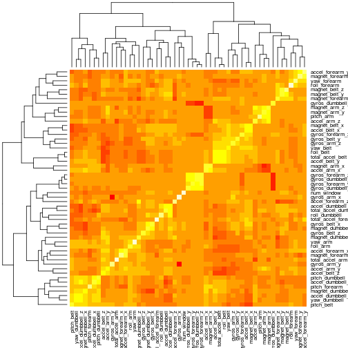

# Prediction: how good an exersize is performed

## Reading the data

```r
if(!file.exists("pml-training.csv")){
    URL <- "https://d396qusza40orc.cloudfront.net/predmachlearn/pml-training.csv"
    download.file(URL, "pml-training.csv", method="wget")    
}
DF <- read.csv("pml-training.csv" )
dim(DF)
```

```
## [1] 19622   160
```

## Subsetting and dividing the data


```r
library(caret)
```

```
## Loading required package: lattice
## Loading required package: ggplot2
```

```r
set.seed(123)
inTrain = createDataPartition(DF$classe, p = 0.6)[[1]]
TR = DF[ inTrain,] ;    VAL = DF[-inTrain,]
```

Now we will remove data variables which, as we expect, should not influence a prediction.


```r
TR <- subset(TR, select=-X) #remove number of a case
TR <- TR[, -grep("time", names(TR))]  #eliminate time variables
TR <- TR[, -grep("user_name", names(TR))] #eliminate user name
```

### Factor variables
Let us work with factor and numeric variables separately. Here is a subset of only factor variables:


```r
TRfac <- TR[, sapply(TR, is.factor)]
```

Now we can remove factors with too many levels. Probably we can convert some of such factors to numeric values, but may be we do not need to..


```r
#find factors with too many levels - hard to compute..
TooManyLevels <- sapply(sapply(TRfac, levels), length) > 10
TRfac <- TRfac[, ! TooManyLevels]
```

There are only two factor variables with meaningful values - let us remove other.


```r
##Find meaningful factors
for (n in 1:dim(TRfac)[2]) print(table(TRfac[, n]));
#only two factors have meaningfull values
TRfac <- TRfac[, c("new_window", "classe")]
```

### Numeric variables
For numeric variables we remove those close to zero and also those having too many NAs (more than a half).


```r
TRnum <- TR[, ! sapply(TR, is.factor)]
TRnum <- as.data.frame(lapply(TRnum, as.numeric))

#remove variables wich do not change (their variance is close to zero)
zero_var_pos <- nearZeroVar(TRnum)
TRnum <- subset(TRnum, select=-zero_var_pos)

for (n in length(TRnum):1){
    if ( sum( is.na(TRnum[ , n]) ) > dim(TRnum)[1]/2 )
        TRnum <- TRnum[ ,-n];
}
```

Now let us impute missing values. 


```r
PreObj <- preProcess(TRnum, method="knnImpute", k=5, na.remove=TRUE)
TRnumPR <- predict(PreObj, TRnum)
```

For the imputed dataset we can calculate correlation and leave in dataset only the variables with a very week correlation.


```r
descrCor <- cor(TRnumPR); heatmap(descrCor)
```

 

```r
highlyCorDescr <- findCorrelation(descrCor, cutoff = 0.3)
TRnumPR <- TRnumPR[, -highlyCorDescr]
descrCor <- cor(TRnumPR) ;   heatmap(descrCor)
```

 

### Combining numeric and factor variables


```r
training <- cbind(TRnum[, -highlyCorDescr], TRfac)
dim(training)
```

```
## [1] 11776    15
```


## Fitting the model

For prediction model we will use Generalized Boosted Models (gbm) with K-fold cross-validation. Here we also use imputation. We use Kappa parameter instead of Accuracy for automatic model selection as a more conservative approach. 


```r
fitControl <- trainControl(method = "repeatedcv", number = 10, repeats = 1)

modFIT <- train(classe ~., data=training, method="gbm", metric = "Kappa",
                trControl = fitControl, preProcess = c("knnImpute"))
```

```
## Loading required package: gbm
## Loading required package: survival
## Loading required package: splines
## 
## Attaching package: 'survival'
## 
## The following object is masked from 'package:caret':
## 
##     cluster
## 
## Loading required package: parallel
## Loaded gbm 2.1
## Loading required package: plyr
```

```r
print(modFIT$finalModel)
```

## Model Performance. Out of sample Error

Bellow we print a 95% confidence interval of the accuracy based on results of a cross-validation. This give us an estimation for out of sample accuracy (which is connected to out of sample error, but is more useful in this case)


```r
AccConfInt <- mean(unlist(modFIT$resample[1])) +
    c(-1, 1)*sd(unlist(modFIT$resample[1]))*qnorm(0.975)
print(AccConfInt)
```

```
## [1] 0.9841 0.9989
```

Results seem to be good.
And now let us make prediction on validation data set. Again the accuracy of prediction is pretty good.


```r
confusionMatrix(predict(modFIT, newdata=VAL), VAL[, "classe"])
```

```
## Confusion Matrix and Statistics
## 
##           Reference
## Prediction    A    B    C    D    E
##          A 2225    0    0    0    1
##          B    0 1515    2    3    1
##          C    2    1 1359   12    2
##          D    1    2    2 1266   17
##          E    4    0    5    5 1421
## 
## Overall Statistics
##                                        
##                Accuracy : 0.992        
##                  95% CI : (0.99, 0.994)
##     No Information Rate : 0.284        
##     P-Value [Acc > NIR] : <2e-16       
##                                        
##                   Kappa : 0.99         
##  Mcnemar's Test P-Value : NA           
## 
## Statistics by Class:
## 
##                      Class: A Class: B Class: C Class: D Class: E
## Sensitivity             0.997    0.998    0.993    0.984    0.985
## Specificity             1.000    0.999    0.997    0.997    0.998
## Pos Pred Value          1.000    0.996    0.988    0.983    0.990
## Neg Pred Value          0.999    1.000    0.999    0.997    0.997
## Prevalence              0.284    0.193    0.174    0.164    0.184
## Detection Rate          0.284    0.193    0.173    0.161    0.181
## Detection Prevalence    0.284    0.194    0.175    0.164    0.183
## Balanced Accuracy       0.998    0.999    0.995    0.991    0.992
```
